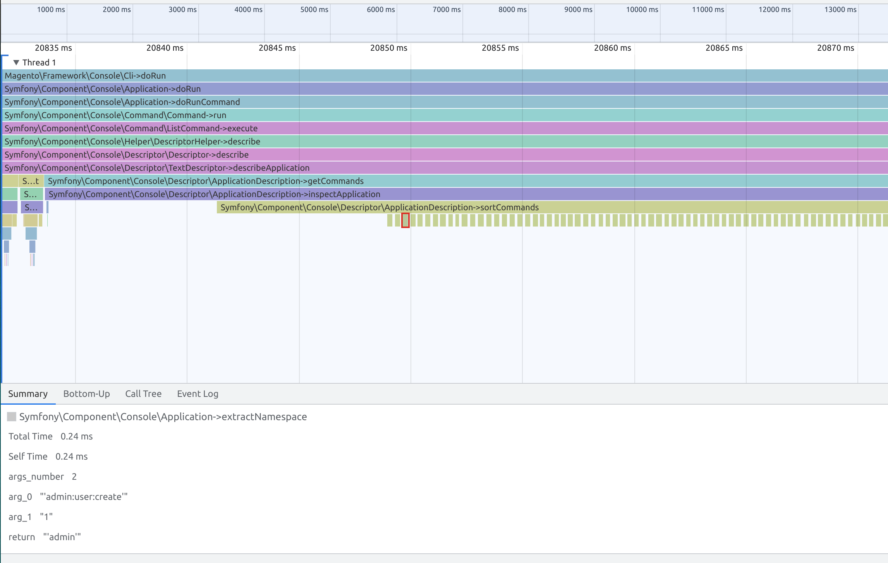
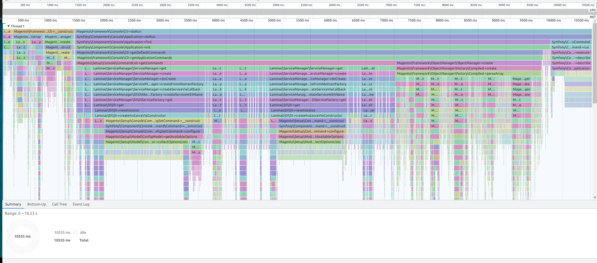
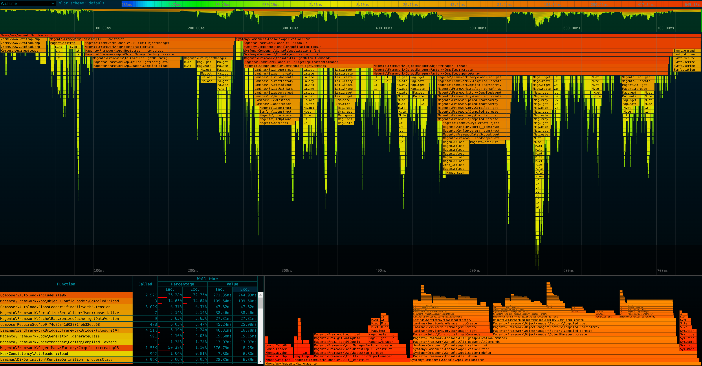

# xDebug Chromium Trace Converter

This is a tool for converting xDebug traces into Chromium format that can be visualized in browser's performance tab.


## Features

- Converts xDebug trace files into the JSON format used by Chromium
- Command-line interface for easy integration into automated workflows

## Requirements

- PHP 7.4 or later
- xDebug extension with `xdebug.trace_format=1` INI setting

## Installation

1. Clone or download this repository to your local machine
2. Add `xtc.php` script to suitable location of your project or link globally
```
ln -s $(pwd)/xtc.php /usr/local/bin/xtc
```
3. Use `xtc.php` script commands to convert your xDebug traces

## Usage

Generate xDebug traces
```
XDEBUG_MODE=trace XDEBUG_TRIGGER=PHPSTORM php {script.php}

#to capture runctions return values
XDEBUG_MODE=trace XDEBUG_TRIGGER=PHPSTORM php -d xdebug.collect_return=1 {script.php}
```

To convert an xDebug trace file, use the `xtc` command and specify the input:
```
xtc.php convert --file=xdebug/dumps/{trace.file}
```
To automatically move converted JSON traces specify the `--out` options with filename or folder
```
xtc.php convert --file=xdebug/dumps/{trace.file} --out=destination/folder/my_trace.json
#OR
xtc.php convert --file=xdebug/dumps/{trace.file} --out=destination/folder/
```
To watch specific directory

```
xtc.php watch --dir=xdebug/dumps/
```
Use same parameters as in `convert` command to apply to profiles.

### Arguments and Return values:

xDebug trace file might collect return values of functions is running with `xdebug.collect_return=1` INI setting.\
When trace is converted with `--args=1` option you can see the values were passed to function and returned.\
Timeline visualization might be extremely useful for debugging or reverse engineering

```
xtc.php convert --file=xdebug/dumps/{trace.file} --args=1
```


Use `--help` option to see more details about command
```
xtc.php convert --help
xtc.php watch --help
```

## Notice about performance measurement:
- Tracing with xDebug add significant overhead and might increase script execution time by x10!

Here is an example of tracing of same script:
- with xDebug ~10s

- with SPX ~1s


Although the visualized traces of both profilers look similar, it's noticeable that xDebug took about x10 to execute.

- If your goal is to analyze performance it's recommended to use profiler with lower overhead than xDebug.
- If you need more information like arguments/returns values during the execution, you can use xDebug and convert the trace with `xtc.php` for more convenient analysis.
- xDebug also collects all calls of php internal functions, but they are excluded by `xtc.php` by default. Use `--internal=1` if you want to see them on timeline. 

## Visualisation

1. Chrome DevTools Performance Tab `Ctr+Shift+J -> Performance`
2. https://ui.perfetto.dev
3. https://www.speedscope.app
4. Any other Chromium trace viewers

## Inspired By

- https://github.com/NoiseByNorthwest/php-spx
- https://github.com/xdebug/xdebug